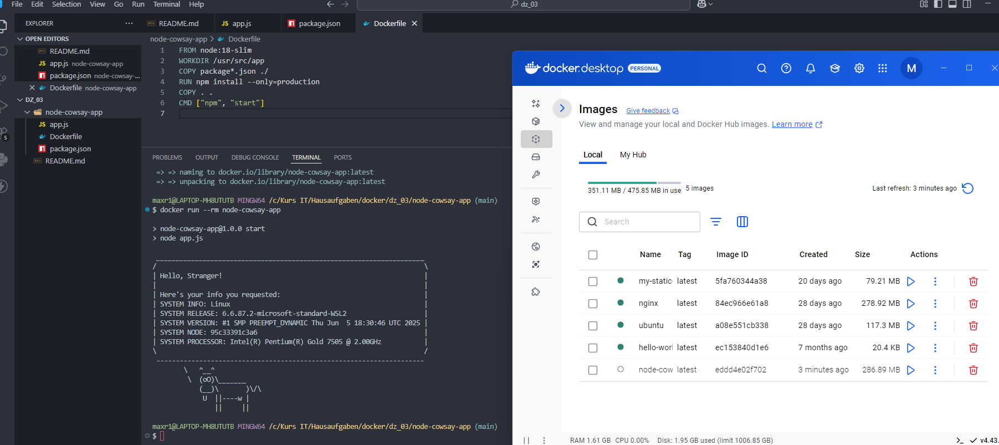

# Домашнее задание 3

## Задание 1 Создать Dockerfile для запуска JavaScript-приложения, которое использует библиотеку cowsay для вывода информации о системе. 
Пришлите готовый Dockerfile.

1. Создать директорию для проекта.

2. Сохранить исходный код приложения в файл app.js.

3. Создать файл package.json для указания зависимостей проекта и добавить в него cowsay.

4. Создать файл Dockerfile.

5. Использовать официальный образ Node.js в качестве базового (например, node:18-slim).

6. Установить зависимости при помощи команды в Dockerfile (не забываем скопировать app.js и package.json, используя COPY).

Выполнить установку зависимостей:

Dockerfile
RUN npm install --only=production

Использовать команду для запуска приложения:

Dockerfile
CMD ["npm", "start"]

---

