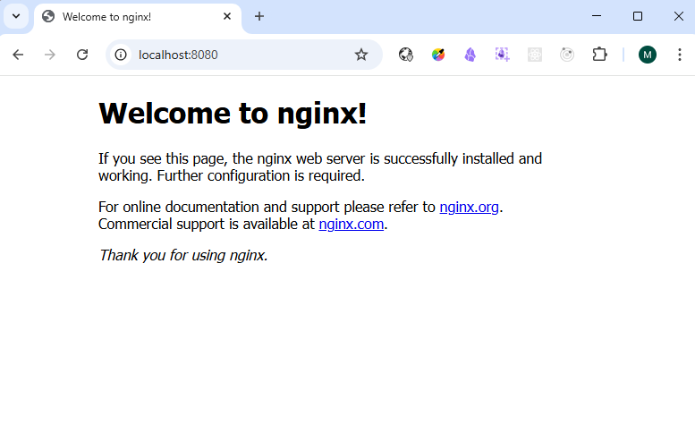

# Домашнее задание 4

## Задание 1 Создайте  многоконтейнерное приложение с помощью Docker Compose, которое состоит из веб-сервера Nginx, базы данных Redis и базы данных MySQL с volume для хранения файлов БД.

1. Написать docker-compose.yml файл для запуска нескольких сервисов: Nginx, Redis и MySQL.
    
2. Настроить volume  mysql_data для хранения данных базы данных MySQL.
    
3. services: Определение сервисов.
- web:
    - image: Используемый образ, в данном случае nginx:latest, это официальный образ Nginx.
    - ports: Проброс порта 8080 на порт 80 контейнера.
- redis:
    - image: redis:latest, это официальный образ Redis.
- mysql:
    - image: Используемый образ mysql:8.0
    - environment: Переменные окружения для настройки базы данных MySQL.
    - volumes: mysql_data для хранения данных базы данных MySQL.

4. networks: Определение сети.
- mynetwork: Сеть, которая соединяет все контейнеры. 

---

---

---

