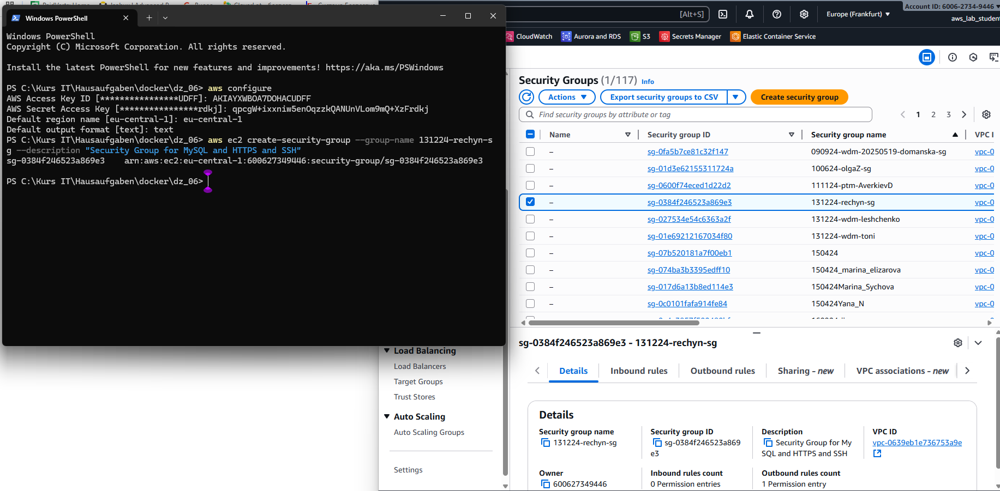
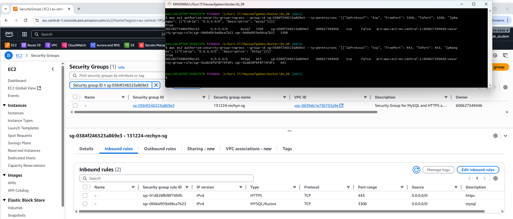
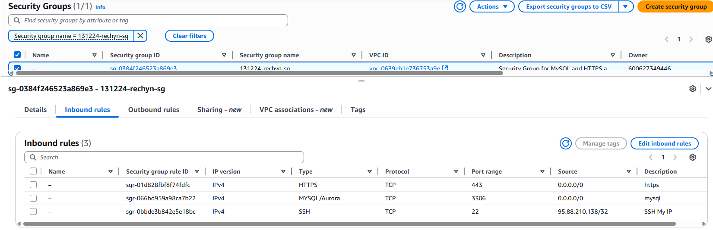
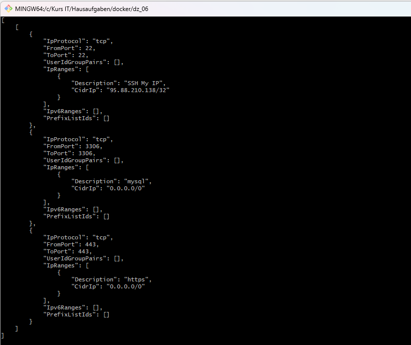

# Домашнее задание 6

## Задание 1 

1. При помощи aws cli создайте security group с вашем Вашим именем и Вашей группой (например --group-name 20240915-andrew-sg) и описанием ("Security Group for MySQL and HTTPS and SSH”) (скопируйте id только что созданной sg, например, sg-092d4ec2208cc14a6)

---
```bash
aws ec2 create-security-group --group-name 131224-rechyn-sg --description "Security Group for MySQL and HTTPS and SSH"
```



---

    
2. При помощи aws cli Добавьте правила входящего (inbound) трафика для портов 3306 (с комментарием mysql) и 443 (с комментарием https) для 0.0.0.0:  (для всех адресов) --cidr 0.0.0.0/0  

---
```bash
aws ec2 authorize-security-group-ingress --group-id sg-0384f246523a869e3 --ip-permissions '[{"IpProtocol": "tcp", "FromPort": 3306, "ToPort": 3306, "IpRanges": [{"CidrIp": "0.0.0.0/0", "Description": "mysql"}]}]'
```

```bash
aws ec2 authorize-security-group-ingress --group-id sg-0384f246523a869e3 --ip-permissions '[{"IpProtocol": "tcp", "FromPort": 443, "ToPort": 443, "IpRanges": [{"CidrIp": "0.0.0.0/0", "Description": "https"}]}]'
```




---

    
3. В в AWS Management Console (UI) - найдите свою security group и добавьте еще одно правило: порт 22 (SSH) для вашего IP-адреса
    
	1. В поле Type выберите SSH (порт 22 будет добавлен автоматически).
    
	2. В поле Source выберите опцию My IP — это автоматически подставит ваш текущий IP-адрес.
    
	3. Добавьте описание в поле Description (опционально, например, “SSH My IP”).
    
---



---


4. Пришлите результат выполнения команды (не забудьте указать id именно Вашей security group! ): 
    
---
```bash
aws ec2 describe-security-groups --group-ids sg-0384f246523a869e3 --query 'SecurityGroups[*].IpPermissions' --output json
```



---


5. Пришлите команды, использованные для создания security group и правил (из п. 1 и 2)

```bash
aws ec2 create-security-group --group-name 131224-rechyn-sg --description "Security Group for MySQL and HTTPS and SSH"
```

```bash
aws ec2 authorize-security-group-ingress --group-id sg-0384f246523a869e3 --ip-permissions '[{"IpProtocol": "tcp", "FromPort": 3306, "ToPort": 3306, "IpRanges": [{"CidrIp": "0.0.0.0/0", "Description": "mysql"}]}]'
```

```bash
aws ec2 authorize-security-group-ingress --group-id sg-0384f246523a869e3 --ip-permissions '[{"IpProtocol": "tcp", "FromPort": 443, "ToPort": 443, "IpRanges": [{"CidrIp": "0.0.0.0/0", "Description": "https"}]}]'
```
    
6. Удалите Вашу security group с inbound и outbound правилами


