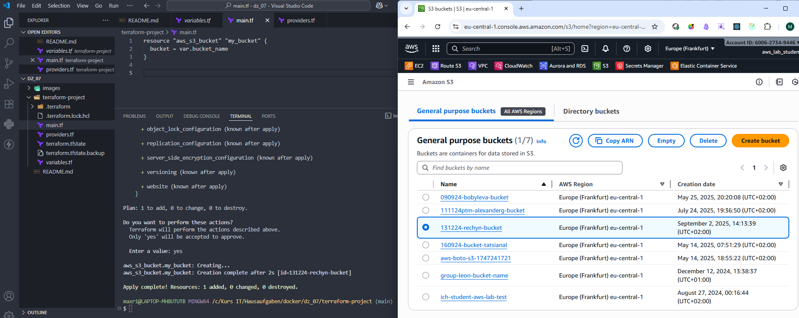

# Домашнее задание 7

## Задание 1 Создание S3 бакета с использованием Terraform в аккаунте AWS_lab 

1. Создайте три файла:

- main.tf для описания ресурса (S3 бакет).
- providers.tf для настройки провайдера AWS ( регион Frankfurt ).
- variables.tf для объявления переменной, которая задает имя S3 бакета с использованием значения по умолчанию.

2. Имя бакета и теги:

- Имя бакета должно задаваться через переменную bucket_name.
- Задайте значение по умолчанию для переменной bucket_name в файле variables.tf, например, "group-bucket-name", где group - Ваша группа , а name -Ваше имя. 
- Присвойте теги для вашего бакета - name и environment

3. Используйте Terraform:

- Выполните инициализацию, планирование и развертывание с помощью команд terraform init, terraform plan и terraform apply.    

4. Удалите созданные ресурсы:   

- После успешного создания ресурса выполните команду terraform destroy для удаления S3 бакета.   
- Сохраните вывод команды terraform destroy в файл destroy-output.txt.   

5. Загрузите, как результат выполнения ДЗ:    

- Файл destroy-output.txt, содержащий вывод команды terraform destroy, который подтверждает удаление S3 бакета.   
- Скриншот вывода команды terraform apply, чтобы показать, что бакет был успешно создан перед удалением либо ссылку на github репозиторий с terraform кодом

---

---

    

